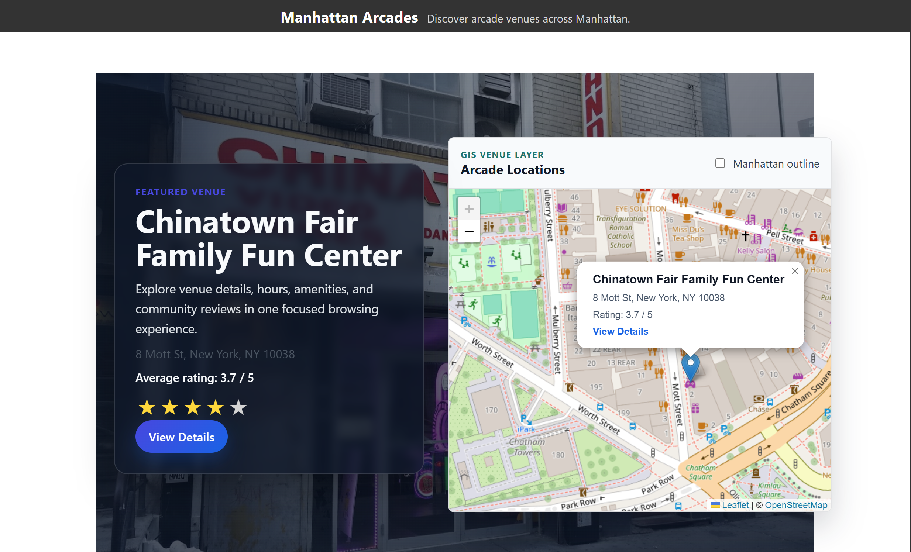
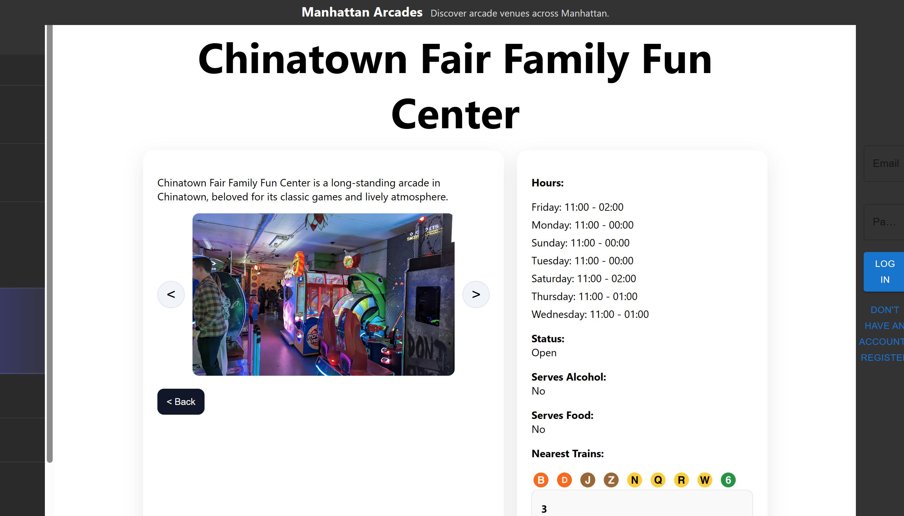
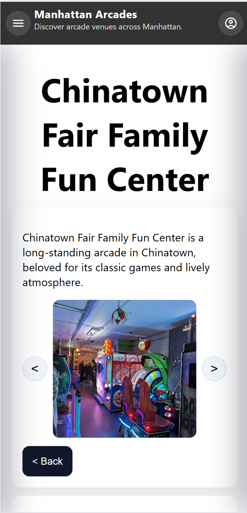

# Manhattan Arcades

Manhattan Arcades is a full-stack geospatial discovery platform for exploring arcade venues across Manhattan.

**Portfolio positioning:** Manhattan Arcades — Full-Stack Geospatial Discovery Platform

## Live Demo

https://manhattan-arcades-app-f2e0f81c5116.herokuapp.com/

## Screenshots

### Home


### Venue Detail


### Mobile View


## Features

- Browse arcade venues across Manhattan
- Explore venues on an interactive Leaflet map
- Open marker popups with venue names, addresses, ratings, and detail links
- Query venues through GeoJSON and nearby spatial API endpoints
- View detailed venue information (hours, amenities, location)
- See nearby transit options
- User authentication (JWT-based)
- Leave ratings and written reviews
- Manage reviews from a profile page
- Fully responsive design (desktop + mobile)

## Tech Stack

**Frontend**
- React
- React Router
- Axios
- Leaflet
- React Leaflet

**Backend**
- Node.js
- Express

**Database**
- PostgreSQL
- PostGIS

**Authentication**
- JWT

## Geospatial Engineering Highlights

- PostGIS-backed venue locations using `geography(Point, 4326)`
- GeoJSON FeatureCollection endpoint for map-ready venue data
- Distance-based nearby search with `ST_DWithin`
- Distance results calculated with `ST_Distance`
- Leaflet map visualization with arcade venue markers
- Spatial GiST index for efficient location queries

## GIS Features

The home experience now combines the existing venue sidebar with an interactive map. Selecting a venue from the sidebar updates the detail panel, while clicking a map marker selects the same venue and opens a popup with the venue name, address, average rating, and a View Details link.

The backend exposes venue locations as standards-friendly GeoJSON:

```http
GET /api/venues/geojson
```

It also supports radius-based spatial search:

```http
GET /api/venues/nearby?lat=40.7566&lng=-73.9887&radius=1000
```

The nearby endpoint validates latitude, longitude, and radius query params, uses parameterized SQL, filters with `ST_DWithin`, returns `distance_meters` from `ST_Distance`, and sorts nearest venues first.

An optional lightweight Manhattan outline layer is available from:

```text
client/public/geojson/manhattan-outline.geojson
```

## Database Migration

Run the PostGIS migration after the PostgreSQL database is available:

```bash
psql "$DATABASE_URL" -f migrations/001_add_postgis_venue_locations.sql
```

For local `.env` database settings, use the equivalent connection string:

```bash
psql "postgresql://$DB_USER:$DB_PASSWORD@$DB_HOST:$DB_PORT/$DB_NAME" -f migrations/001_add_postgis_venue_locations.sql
```

The migration:

- Enables the PostGIS extension
- Adds `latitude`, `longitude`, and `location geography(Point, 4326)` columns to `arcades`
- Backfills sample coordinates for the existing Manhattan arcade venues
- Keeps `location` synchronized from latitude/longitude with a trigger
- Adds `idx_arcades_location` as a GiST spatial index

## Development

Install server dependencies from the repository root:

```bash
npm install
```

Install client dependencies:

```bash
cd client
npm install
```

The GIS map requires:

```bash
cd client
npm install leaflet react-leaflet@4
```

Start the Express API:

```bash
npm run dev
```

Start the React client:

```bash
cd client
npm start
```

## Deployment Notes

- The production PostgreSQL instance must have PostGIS available before running the migration.
- Run `migrations/001_add_postgis_venue_locations.sql` during deployment or as a one-time database migration.
- Keep `DATABASE_URL` configured for the Express server in production.
- The React client proxies API requests to `http://localhost:5000` locally and uses `REACT_APP_API_URL` when configured.
- Leaflet map tiles load from OpenStreetMap, so production deployments should allow external tile image requests.

## GIS Developer Relevance

This project demonstrates practical geospatial engineering in a familiar full-stack architecture: spatial schema design, map-ready GeoJSON output, indexed PostGIS queries, distance search in meters, and an interactive map UI that stays connected to normal application routing and detail views.

## What I Focused On

- Clean, modern UI and visual hierarchy
- Mobile-first responsive design
- Smooth navigation and user flow
- Structuring location-based data for easy browsing
- Building a production-style full-stack experience
- Adding portfolio-ready GIS features without rewriting the existing app
